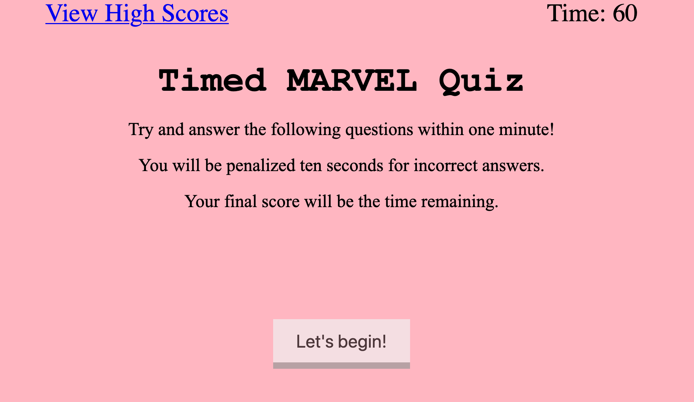

# TimedCodeQuiz
<h3>Description</h3>

 This code quiz involves having the user going through a JavaScript quiz based off of the following criteria: 

GIVEN I am taking a code quiz

WHEN I click the start button

THEN a timer starts and I am presented with a question

WHEN I answer a question

THEN I am presented with another question

WHEN I answer a question incorrectly

THEN time is subtracted from the clock

WHEN all questions are answered or the timer reaches 0

THEN the game is over

WHEN the game is over

THEN I can save my initials and score 

<h3>Source Type </h3>

JavaScript

<h3>The Website</h3>

Here is the link to the <a href ="https://mcgeevee.github.io/TimedCodeQuiz" >website</a>

<h3>License</h3>

<a href="https://choosealicense.com/licenses/mit/#">MIT</a> License
